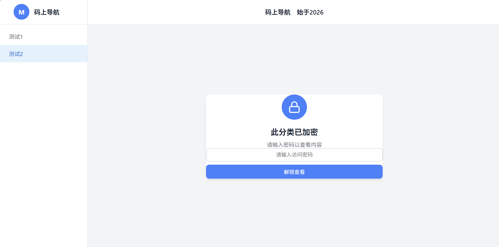
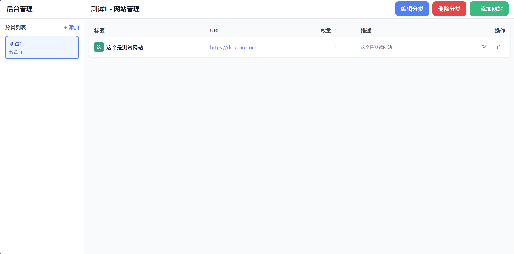
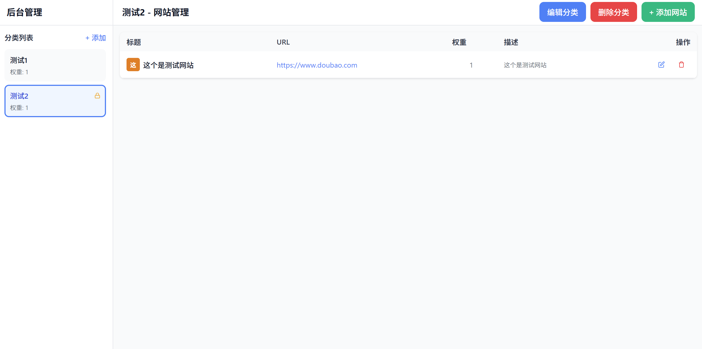

# 码上导航 - 超轻量个人导航站

<div align="center">


一个简洁、轻量、易部署的个人导航网站系统，专为虚拟主机环境设计。

**2元/月 即可拥有自己的导航站**

</div>

---

## 💡 项目初衷

互联网上的内容很多，网站很多，链接很多，有时候记不住，也没有好的方法存，每次查找都很麻烦

我在网上找了很多聚合站、导航站，但大多都是功能复杂、部署繁琐的后端系统，对于个人用户来说过于臃肿。

于是我用 PHP + MySQL 写了这个超轻量的个人网站导航系统，专为虚拟主机环境设计：
- ✅ 无需 Node.js、Docker 等复杂环境
- ✅ 无需 VPS 服务器
- ✅ 2元/月的虚拟主机即可运行
- ✅ 5分钟完成部署

让每个人都能轻松拥有自己的导航站，管理自己的常用网站。

## 📸 项目展示

### 前台页面

*前台首页 - 简洁的导航界面*


*前台展示 - 分类浏览*


*前台展示 - 响应式布局*

### 后台管理

*后台管理 - 分类与网站管理*


*后台管理 - 编辑界面*


*后台管理 - 详细功能展示*

## ✨ 功能特性

### 前台功能
- 🎨 **简洁美观** - 现代化 UI 设计，响应式布局
- 📁 **分类管理** - 支持多级分类，自定义排序
- 🔒 **密码保护** - 分类可设置访问密码
- 🎨 **随机图标** - 网站图标自动生成随机颜色
- 📋 **一键复制** - 快速复制网站链接
- 📱 **移动适配** - 完美支持手机、平板访问

### 后台功能
- 🔧 **分类管理** - 添加、编辑、删除分类
- 🌐 **网站管理** - 批量管理导航网站
- ⚖️ **权重排序** - 自定义显示顺序
- 🔐 **密码设置** - 为敏感分类设置访问密码
- 📝 **描述编辑** - 支持网站描述信息

## 🛠️ 技术栈

- **后端**: PHP 7.0+
- **数据库**: MySQL 5.6+ / MariaDB
- **前端**: 原生 JavaScript + CSS
- **架构**: RESTful API 设计
- **特点**: 
  - 无框架依赖，纯原生开发
  - 单文件架构，易于维护
  - 轻量级设计，加载速度快

## 📦 环境要求

- PHP 7.0 或更高版本
- MySQL 5.6 或更高版本
- PDO 扩展（通常默认启用）

## 🚀 快速开始

### 推荐：星辰云虚拟主机部署

**为什么推荐星辰云？**
- 💰 价格低至 2元/月
- ⚡ 免费二级域名
- 🗄️ 自带 MySQL 数据库，无需手动创建
- 📁 可视化文件管理，无需 FTP 工具
- ⚡ 一键部署，5分钟搞定

👉 [立即购买星辰云虚拟主机](https://console.starxn.com?l=ZVhUWd)

---

### 部署步骤

#### 1. 下载项目

访问 [GitHub](https://github.com/super-mortal/nav-site) 下载最新版本的 ZIP 压缩包。

#### 2. 解压文件

解压下载的 ZIP 文件，得到以下文件：

```
nav-site/
├── index.php       # 前台页面
├── admin.php       # 后台管理
├── api.php         # API 接口
├── config.php      # 数据库配置
├── install.php     # 安装脚本
├── style.css       # 样式文件
└── logo.png        # Logo 图片（可选）
```

#### 3. 配置数据库

编辑 `config.php` 文件，填入你的数据库信息：

```php
// 数据库主机地址（通常是 localhost）
define('DB_HOST', 'localhost');

// 数据库名称（星辰云会自动创建）
define('DB_NAME', 'nav_site');

// 数据库用户名（在控制面板查看）
define('DB_USER', 'your_username');

// 数据库密码（在控制面板查看）
define('DB_PASS', 'your_password');
```

**星辰云用户**：登录控制面板，在主机详情中可以看到数据库信息。

#### 4. 上传文件

**星辰云虚拟主机**：
1. 登录星辰云控制面板
2. 进入"文件管理"
3. 点击"上传文件"
4. 选择所有项目文件上传到网站根目录

**其他虚拟主机**：
使用 FTP 工具（如 FileZilla）上传文件到网站根目录。

#### 5. 运行安装

在浏览器访问：`http://你的域名/install.php`

看到 "✓ 数据库表创建成功！" 表示安装完成。

#### 6. 删除安装文件

**重要**：安装完成后，删除 `install.php` 文件，防止被重复执行。

#### 7. 开始使用

- **前台访问**: `http://你的域名/index.php`
- **后台管理**: `http://你的域名/admin.php`

---

## 📝 使用说明

### 自定义 Logo

1. 准备一张正方形图片（推荐 200x200 或 512x512 像素）
2. 命名为 `logo.png`
3. 上传到网站根目录
4. 刷新页面即可看到效果

### 设置默认首页

创建或编辑 `.htaccess` 文件：

```apache
DirectoryIndex index.php
```

这样访问 `http://你的域名/` 就会自动打开 `index.php`

### 保护后台

**方法一：使用 .htaccess**

创建 `.htaccess` 文件：

```apache
<Files "admin.php">
    AuthType Basic
    AuthName "后台管理"
    AuthUserFile /path/to/.htpasswd
    Require valid-user
</Files>
```

**方法二：虚拟主机面板**

在控制面板中为 `admin.php` 设置密码保护。

## 💰 成本说明

使用星辰云虚拟主机部署：
- 虚拟主机：2元/月起
- 域名：首年约 10-30 元（可选，可用 IP 访问）
- SSL 证书：免费（Let's Encrypt）

**总计：每月仅需 2 元，即可拥有自己的导航站！**

## 📊 数据库容量

16MB 数据库可存储：
- **40,000 - 50,000** 个网站
- **100 - 200** 个分类

对于个人或中小型导航站完全够用。

## 🔧 常见问题

### 1. 数据库连接失败？

检查 `config.php` 中的配置是否正确：
- 数据库主机地址
- 数据库名称
- 用户名和密码

### 2. 安装时提示索引长度错误？

这是 MySQL 版本问题，项目已修复。重新下载最新版本即可。

### 3. 如何修改网站标题？

编辑 `index.php` 和 `admin.php` 中的 `<title>` 标签。

### 4. 如何备份数据？

在虚拟主机控制面板的 phpMyAdmin 中导出数据库即可。

### 5. 忘记后台密码怎么办？

如果设置了 .htaccess 密码保护，删除 `.htaccess` 文件即可。

## 📂 项目结构

```
nav-site/
├── index.php           # 前台展示页面
├── admin.php           # 后台管理页面
├── api.php             # RESTful API 接口
├── config.php          # 数据库配置文件
├── config.example.php  # 配置文件示例
├── install.php         # 数据库安装脚本
├── style.css           # 全局样式文件
├── logo.png            # 网站 Logo（可选）
├── .gitignore          # Git 忽略配置
├── LICENSE             # 开源协议
└── README.md           # 项目说明文档
```

## 🤝 贡献指南

欢迎提交 Issue 和 Pull Request！

1. Fork 本项目
2. 创建特性分支 (`git checkout -b feature/AmazingFeature`)
3. 提交更改 (`git commit -m 'Add some AmazingFeature'`)
4. 推送到分支 (`git push origin feature/AmazingFeature`)
5. 提交 Pull Request

## 📄 开源协议

本项目采用 [MIT](LICENSE) 协议开源。

## 💬 联系方式

- 项目地址: [GitHub](https://github.com/super-mortal/nav-site)
- 问题反馈: [Issues](https://github.com/你的用户名/nav-site/issues)
- 我的邮箱: 2169702639@qq.com

## 🌟 Star History

如果这个项目对你有帮助，请给个 Star ⭐️

---

<div align="center">

**[⬆ 回到顶部](#码上导航---超轻量个人导航站)**

Made with ❤️ by [super-mortal]

</div>
